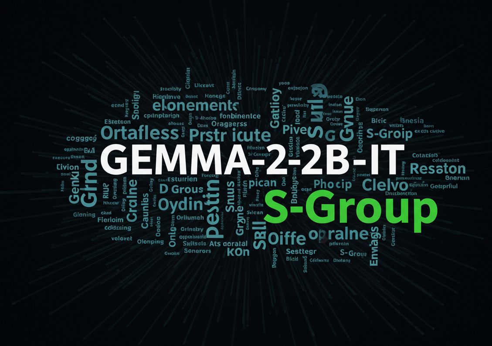

# Gemma-2–2b-it fine-tuning on a local laptop using S Group's Q&A data

This repository demonstrates how to fine-tune the Gemma-2-2b-it model on a local laptop using the Unsloth library. Unsloth enables fast and memory-efficient fine-tuning. The example uses a small dataset of 248 question-answer pairs from S-Group. While this small dataset will likely lead to overfitting, it effectively showcases the fine-tuning process using Unsloth. This repository is intended as a demonstration of the fine-tuning method, not a production-ready solution.



The laptop we use for fine-tuning is a Windows machine with Ubuntu WSL. It has 32GB of RAM and 16GB of VRAM, but the fine-tuning runs on a much smaller machine. Fine-tuning is done on the Ubuntu side and Cuda is called on the Windows side. To make everything work together, we chose Cuda version 12.1, Torch 2.5.1+cu121, Transformers 4.47.1 and Flash-attn 2.7.3. In order to call Windows NVIDIA nvcc.exe from Ubuntu, we need a wrapper that converts the Linux nvcc command into nvcc.exe.

## Virtual environment creation

The installation includes several complex python libraries that must be installed in the correct order. The Python version used is 3.12.8.  Below are the commands needed to create the virtual environment.

```python
python -m venv .env
source .env/bin/activate
pip install --upgrade pip
pip install torch torchvision torchaudio --index-url https://download.pytorch.org/whl/cu121
pip install -r requirements.txt
python -m ipykernel install --user --name .env
jupyter notebook
```

## Wrapper

The wrapper is as included. It converts the unic nvcc command into nvcc.exe command.

```python
#!/bin/bash

# Configuration
WINDOWS_NVCC_PATH="C:\\Program Files\\NVIDIA GPU Computing Toolkit\\CUDA\\v12.1\\bin\\nvcc.exe"  # Full path to nvcc.exe on Windows

# Convert the Windows path to a path that PowerShell can understand
WSL_NVCC_PATH=$(wslpath -a "$WINDOWS_NVCC_PATH")

# Replace forward slashes with backslashes
WINDOWS_PATH=$(echo "$WSL_NVCC_PATH" | tr '/' '\\')

# Replace /mnt/c with C:
WINDOWS_PATH=$(echo "$WINDOWS_PATH" | sed 's/^\\mnt\\c/C:/')

# Execute the command using powershell.exe
powershell.exe -NoProfile -NonInteractive -Command "& \"$WINDOWS_PATH\" $*"
```

The wrapper can locate, for example, the $HOME/bin directory and the path

```python
export  PATH="$HOME/bin:$PATH"
```

is added to .bashrc file. Now in Ubuntu, if the user presses

```python
nvcc --version
```
the result is 

```python
nvcc: NVIDIA (R) Cuda compiler driver
Copyright (c) 2005-2023 NVIDIA Corporation
Built on Mon_Apr__3_17:36:15_Pacific_Daylight_Time_2023
Cuda compilation tools, release 12.1, V12.1.105
Build cuda_12.1.r12.1/compiler.32688072_0
```

# Execution

The execution of fine-tuning can be found in the file Gemma_2_2b-it-finetuning.ipynb. A fine-tuned model can be found at [Huggingface](https://huggingface.co/mlconvexai/gemma-2-2b-it-S-Group).
